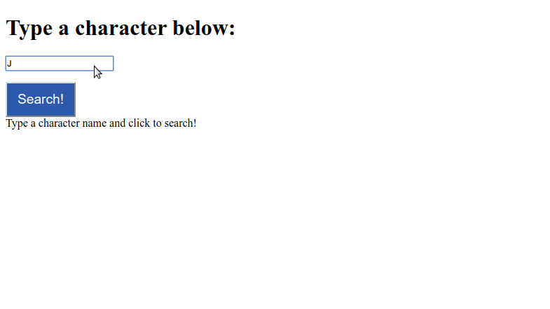

Esse é um exercício para o conteúdo da semana 17, sobre `React com Redux`.

### Antes de iniciar

Crie um fork desse projeto e para isso siga esse [tutorial de como realizar um fork](https://guides.github.com/activities/forking/).

Após feito o fork, clone o repositório criado para o seu computador.

Rode o `npm install`.

Vá para a branch master do seu projeto e execute o comando:
- `git branch` 

Verifique se as seguinte branch aparece:

  `exercise-GOT`

- Mude para a branch `exercise-GOT` com o comando `git checkout exercise-GOT`. É nessa branch que você realizará a solução para o exercício.

Observe o que deve ser feito nas instruções.

Após a solução dos exercícios, abra um PR no seu repositório forkado e, se quiser, mergeie para a master, sinta-se a vontade!

**Atenção!** Quando for criar o PR você irá se deparar com essa tela:

É necessário realizar uma mudança. Clique no *base repository* como na imagem abaixo:

Mude para o seu repositório. Seu nome estará na frente do nome dele, por exemplo: `antonio/NOME_DO_EXERCÍCIO`. Depois desse passo a página deve ficar assim:

Agora basta criar o PULL REQUEST clicando no botão `Create Pull Request`.

Para cada PR realize esse processo.

### COMEÇANDO OS EXERCÍCIOS

#### Exercício 1

Vamos fazer uma pequena aplicação que nos permitirá buscar informações sobre os personagens da famosa série de livros "Guerra dos Tronos".

Adiante, você encontrará alguns componentes react prontos. Além do próprio `App`, você terá o componente `SearchForm` - que se trata de um componente de classe que armazena o valor de `inputText` na medida que se digita algo no campo de busca e, quando se clica no botão da página, leva o texto digitado como valor de `inputChar`.

Já o componente `charInfo` exibe na tela informações obtidas através da API (que já está disponível na pasta `services`)- tais como o nome completo, os apelidos, o gênero e os livros em que o personagem aparece.

(se ficou sem entender alguma parte, estude a aplicação e coloque um `console.log()` na propriedade que estiver com dúvidas).

Então, a API está pronta, os componentes estão prontos, mas você foi incumbido de obter as informações da API e conectar esses dados para seus componentes utilizando `Redux` e `redux-thunk`. Para tanto:

1- Crie a aplicação, dê um `npm install` e, em seguida, instale `redux`, `react-redux` e `redux-thunk`. Crie o `thunk` que fará a requisição para a API e as `actions` referentes ao retorno com sucesso ou falha na dita requisição (não se esqueça de importar a função `charAPI.js` no seu arquivo `actions.js`).

2- Crie o `Reducer` que tratará as `actions` criadas no passo 1 e insira-o no `combineReducers`. Crie a store utilizando o `middleware` `thunk` ***importante:*** a API retorna uma array com um único objeto, logo você precisa acessar a posição do array para, em seguida, se utilizar do objeto.

3- Conecte a `action` a ser despachada no seu componente `SearchForm` e os `states` oriundos do reducer no componente Charinfo, bem como prepare o componente para exibir uma mensagem em caso de erro da API.

4- Utilize a `Prop` importadas do seu `reducer` para renderizar o as informações na tela. Ao final, sua aplicação ficará mais ou menos assim:

P.S.: a nossa aplicação somente consegue fazer buscas pelo nome completo do personagem - ou seja, procurar somente por _Tyrion_ não nos dará nenhum retorno, já _Tyrion Lannister__ sim.