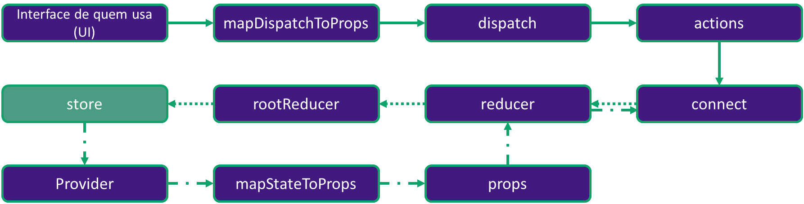
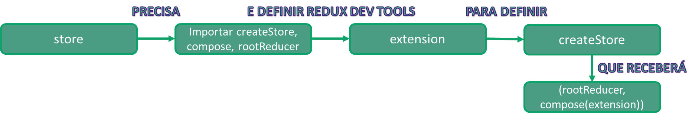

<<<<<<< HEAD
# Vamos começar com tudo os exercícios desse repositório de React-Redux.

**Após forkar e clonar o repositório, é necessário trocar para a branch do exercício e entrar no diretório da aplicação para então executar o comando *npm install* e instalar as dependências necessárias (verifique a existência do arquivo package.json no diretório para ter certeza que está no local correto)**

## ⚠️ ATENÇÃO! Não clone o repositório sem realizar seu fork! ⚠️

- Para acessar o exercício sobre **store**:
```javascript
git checkout exercise-1
```

- Para acessar o exercício sobre **reducers**:
```javascript
git checkout exercise-2
```

- Para acessar o exercício sobre **actions**:
```javascript
git checkout exercise-3
```

- Para acessar o exercício sobre **Provider**:
```javascript
git checkout exercise-4
```
- Para acessar o exercício sobre **mapStateToProps**:
```javascript
git checkout exercise-5
```

- Para acessar o exercício sobre **connect**:
```javascript
git checkout exercise-6
```

- Para acessar o exercício sobre **mapDispatchToProps e dispatch**:
```javascript
git checkout exercise-7
```

Para melhor organização, **commite** as alterações que fizer nas branchs de cada exercícios antes de ir para a próxima!

##### Há um arquivo com gabarito aqui na branch principal, mas realizar todos os exercícios é muito importante para o domínio do React-Redux.
=======
## Entendendo o infograma de uma store



### Análise do passo a passo


```javascript
cd missing_store
npm install
npm start
```

Abra a aplicação no browser para ver como ela está! Em src/store foi retirado o conteúdo no arquivo index.js.
Seu objetivo é criar o código da store para fazer a aplicação rodar corretamente com React-Redux.

Para facilitar a visualização dos estados, você pode acrescentar como segundo parâmetro do createStore a extensão Redux Devtools:

```javascript
const extension = window.devToolsExtension() || ((f) => f);
```

**Referências:**
- Imagem garfieldLasagna: https://pixy.org/src/124/1246733.jpg.
>>>>>>> exercise-1
