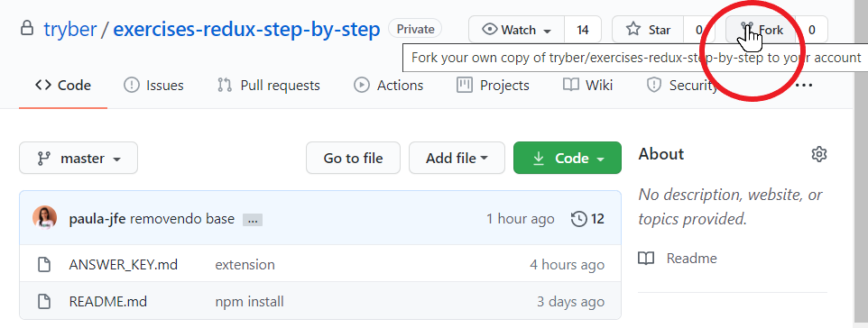

## Gerenciamente de estados complexos com Context API e React Hooks


### Para fazer um fork

**1 - Clique no botão "Fork" do repositório.**



**2 - Selecione seu usuário do GitHub.**


**3 - Escolha a URL remota (SSH, HTTPS) para fazer o clone do repositório.**


### Instruções


Hoje você trabalhará com o melhor aplicativo no ramo de entrega de comida de toda a internet, o try-food.
No momento precisamos melhorar essa aplicação e centralizar os estados que são utilizados por vários componentes em um contexto. Performance é muito importante e a manutenção do código deve ser feita da melhor maneira possível.
A equipe de engenharia começou a migrar tudo para Context API mas eles pararam para almoçar e você, que sabe que falta pouca coisa para fazer a aplicação funcionar, decidiu terminar a última função e colaborar com o resultado da equipe.

Você receberá um código que simula essa aplicação e precisará completar esse código para ver a aplicação em funcionamento. A parte mais importante é treinar manipulação de estados dentro do arquivo **src/context/MyProvider.js**, onde a função **handleChange** está vazia. Devido a função handleChange estar vazia, sua aplicação estará quebrada, e portanto, a página Order.js não está recebendo o MyProvider.js com os estados da aplicação, fazendo com sua ramificação (filhos) também não receba o contexto com os estados.

***Dica: Header.js, Cart.js e Options.js são componentes renderizados pela página Order.js e todos utilizam o contexto da aplicação***

Analise o código da aplicação e pense como atualizar individualmente a lista de **comida, bebida** e **sobremesa**, que são arrays contidos no objeto **orderList**.

#### Esquema de pastas e arquivos


- **try-food:** Diretório com toda a aplicação.
- **src:** Diretório que contém seu código JavaScript, JSX.
- **components:** Diretório que contém os componentes utilizados na aplicação.
- **context:** Diretório que contém o contexto da aplicação e o provedor de estados da sua aplicação.
- **pages:** Diretório que contém as páginas da aplicação, ou seja, as páginas configuradas por rotas.
- **index.js:** Arquivo que trata de encontrar o arquivo raiz da aplicação e implementa o código React nele. O index.js importa a biblioteca react-dom e contém o BrowserRouter, que realiza a implementação de rotas para navegadores HTML5 e informa a aplicação que teremos roteamento de componentes a partir daquele ponto. Esta implementação encapsula App.js.
- **App.js:** Arquivo que representa o elemento raiz da aplicação, a partir dele haverá ramificações. Esta implementação encapsula Routes.js.
- **Routes.js:** Arquivo que centraliza todas as rotas da aplicação (boa prática).

##### Dentro da master

```javascript
cd try-food
npm install
npm start
```

##### Dicas importantes:

- Pense em três condições: (1 - Não há o item na lista; 2 - Há o item na lista; 3 - A quantidade do item na lista passou a ser zero (0));
- A lista de comidas, bebidas e sobresas são exibidas individualmente;
- O uso do spread (...) pode te ajudar nas lógicas que acrescentam posições no array (sem substituir;
- A função handleChange recebe informações do componente **src/components/Options.js**, que é um filho da página **src/pages/Order.js**;
- Você precisará do Hook useState para essa função.

#### Baby steps:

1. Vamos entender como a estrutura do Provider ficará.
No início temos dois estados. O primeiro receberá separadamente os dados de "comida", "bebida" e "sobremesa" em um array, e o segundo controlará os dados informados no seu componente Header. Se o updateCart for false, o Header terá um botão com o texto 'Ver opções', do contrário o texto será 'Ver sacola'. Para controlar a lógica desse estado, precisaremos da função showCart(). O objetivo único dessa função é trocar o texto do botão de acordo com os cliques realizados pelo usuário.
Vamos compreender agora a lógica de manipulação do primeiro estado, onde você poderá praticar manipulação complexa de estados utilizando Context API.

2. O primeiro passo que devemos pensar é a função que gerenciará as mudanças de estado através das interações no componente filho "Options.js" para que o componente filho "Cart.js" sempre atualize o pedido do cliente. Options.js recebe o contexto da função handleChange, toda vez que um usuário modificar a quantidade de um produto, "Options.js" retornará as informações "event, name, price, e mealType", que serão necessárias para nossa função.

3. O segundo passo consiste em extrair o valor passado no input através do "event" que foi retornado, e definir um novo objeto com as informações atualizadas do produto.

4. No que devemos pensar agora? Elementar jovem padawan, precisamos verificar se o item que criamos está presente em um das 3 listas contidas no objeto que é o nosso estado. Você consegue pensar em uma maneira de fazer essa verificação em apenas uma linha? Vamos lembrar de um conceito aprendido lá em fundamentos do desenvolvimento web. Você lembra que para acessar uma chave dinâmica de um objeto podemos passar essa chave através de [] (colchetes)? Nós recebemos nessa função o "mealType" (ou ItemType), e podemos realizar essa verificação dinamicamente se passarmos essa informação para o "orderList", que é o nosso objeto que contém as chaves (itemType) e suas respectivas listas como valores. *Se queremos descobrir se há algum objeto nas listas igual ao nosso **newItem**, podemos utilizar a função **some**, e comparar se o **item.id** equivale ao nome do item retornado*.

5. Vamos criar uma condição para verificar se devemos adicionar um item na lista ou alterar um item já existente? No passo anterior nós verificamos se existe o item na lista, então agora podemos utilizar o retorno dessa função para decidir qual a próxima função que será chamada. Se não houver o item na lista, então devemos adicionar um item na lista com a função **addItemToList**, passando *newItem* como parâmetro. Se já houver o item na lista, devemos atualizá-lo com a função **manageItemsInList** passando *newItem* como parâmetro.

6. Chegamos aqui, vamos adicionar um novo item na lista? Nossa função recebe o objeto que criamos e atualiza o nosso estado. Lembre-se: Precisamos atualizar a chave correspondente do nosso estado, e para isso podemos utilizar o **itemType** do nosso objeto, para fazer isso dinamicamente.
Como podemos começar? Vamos brincar com o *spread*! Podemos utilizar a função setOrderList({...orderlist, [newItem.itemType]: "aqui entra a lógica necessária para atualizar a lista necessária" }).
Primeiro nós retornamos todo o objeto orderList, e depois passamos a chave que queremos atualizar, essa chave é o newItem.itemType que passamos para essa função.
E qual o valor que demos passar para essa chave? Ela é uma chave que já possui diversos valores, então devemos fazer o spread para recuperar seu conteúdo e só então, adicionar o novo item.

7. Nessa função há duas missões. A primeira missão é verificar se devemos remover o item da lista caso o usuário mude a quantidade dele para 0, e chamar a função responsável por essa atualização. A segunda missão é chamar a função que atualiza a quantidade do item caso o valor seja diferente de 0.
Informações passadas para as funções:
  - orderState: que contém os valores da chave que deve ser atualizada;
  - indexPresentInList: O índice do item no array;
  - newItem: O objeto a ser atualizado ou a chave do objeto a ser atualizado, caso acessado o itemType.

8. Você precisa remover um item da lista. Você já possui o array com os dados que serão atualizados no seu estado, o índice do elemento e a chave que você precisa acessar dentro do objeto, como você faria essa atualização? Você pode utilizar o método **filter** ou o método **splice** por exemplo.

9. Se você precisa fazer apenas o update do item na lista, temos uma complexidade mais desafiadora. Aqui você pode utilizar o *splice passando o terceiro parâmetro*, que indica o novo valor do item naquele índice, e então realizar novamente a atualização do estado com o **spread** de todo o objeto **orderList**, e com a chave e o valor a serem atualizados.

#### Gabarito
*O gabarito do exercício está na pasta **answer_keys** desse repositório.*
